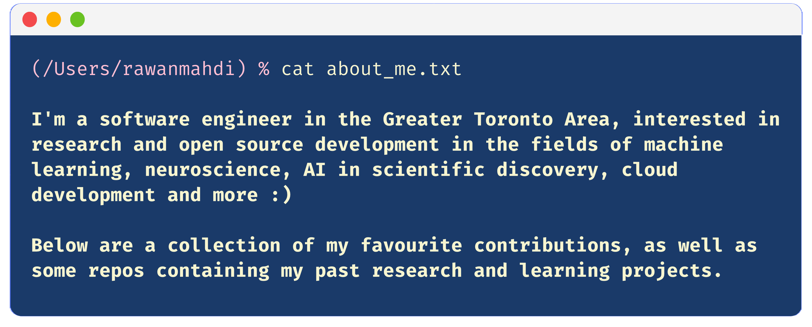
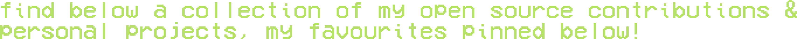

<!--  -->

<!--
 -->

<!-- `i'm a third year software engineering student in the greater toronto area, interested in open`
`source development, all things cloud, and a bit of machine learning.`

`find below a collection of my open source contributions & personal projects, my favs pinned`
`below!`
 -->

<!--  -->

<!--  -->
