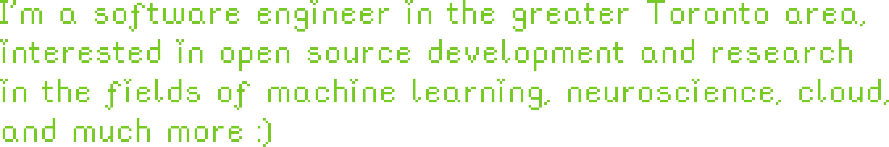

<!--  -->

 
 
 

  <iframe loading="lazy" style="position: absolute; width: 100%; height: 100%; top: 0; left: 0; border: none; padding: 0;margin: 0;"
    src="https://www.canva.com/design/DAGWkDBMU9E/Z-K_fQs6_hz1Jw36M5cQ4w/view?embed" allowfullscreen="allowfullscreen" allow="fullscreen">
  </iframe>

<a href="https:&#x2F;&#x2F;www.canva.com&#x2F;design&#x2F;DAGWkDBMU9E&#x2F;Z-K_fQs6_hz1Jw36M5cQ4w&#x2F;view?utm_content=DAGWkDBMU9E&amp;utm_campaign=designshare&amp;utm_medium=embeds&amp;utm_source=link" target="_blank" rel="noopener">(&#x2F;Users&#x2F;rawanmahdi)</a> by Rawan Mahdi

<!--
 -->

<!-- `i'm a third year software engineering student in the greater toronto area, interested in open`
`source development, all things cloud, and a bit of machine learning.`

`find below a collection of my open source contributions & personal projects, my favs pinned`
`below!`
 -->

<!--  -->

<!--  -->
